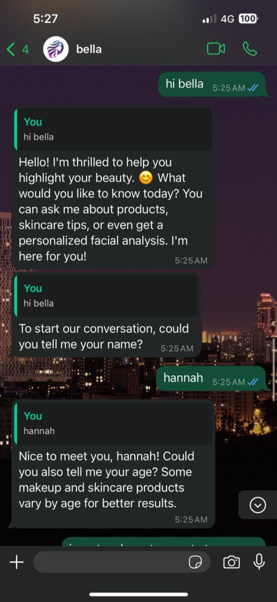
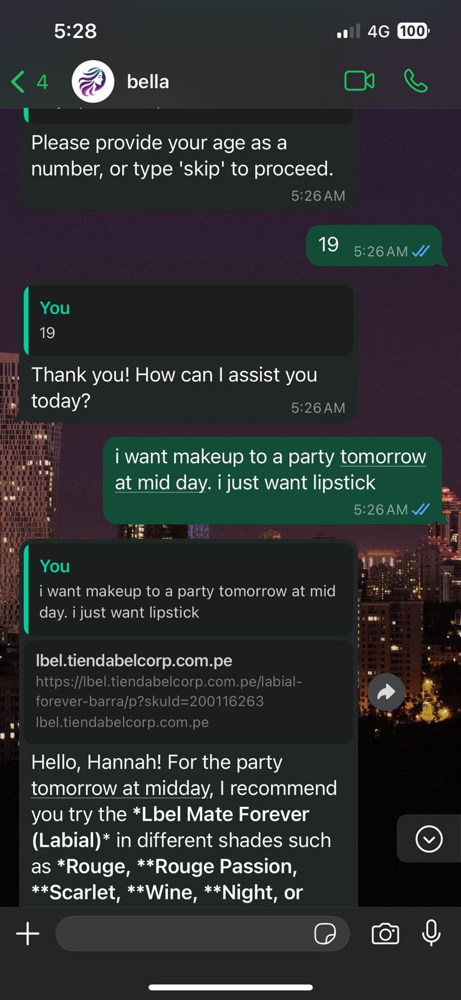
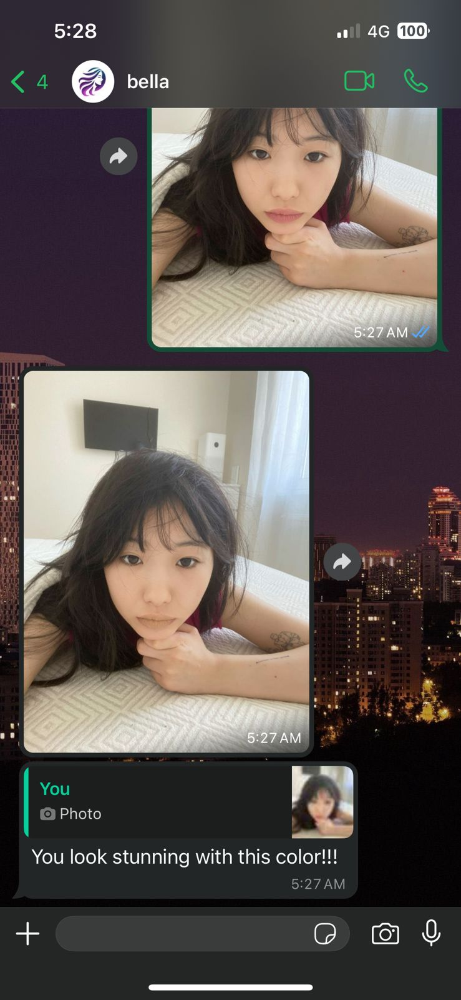

<div align="center">
  
  <h3 align="center">Bella Chatbot - Belcorp Hackathon</h3>
  <p>Grupo 5 · 2024</p>
</div>

# Bella Chatbot

Bella is an artificial intelligence chatbot designed to transform the personalized beauty experience through messaging platforms, such as WhatsApp. This digital assistant allows users to receive beauty product recommendations, facial analysis, and personalized advice without the need for additional apps or augmented reality experiences. Additionally, the Bella API connects users to facial analysis features, allowing clients to virtually try on Belcorp products.

## Table of Contents

- [Bella Chatbot](#bella-chatbot)
  - [Table of Contents](#table-of-contents)
  - [Meet the Team](#meet-the-team)
  - [Features](#features)
  - [Installation](#installation)
    - [Clone the repository](#clone-the-repository)
    - [Install dependencies](#install-dependencies)
    - [Add the Open AI API key](#add-the-open-ai-api-key)
  - [Results](#results)
  - [Software Architecture](#software-architecture)

## Meet the Team

| Members         |
| --------------- |
| Camilla Navinta |
| Leonel Ortega   |
| Lucas Ruiz      |
| Stevens Acha    |
| Oliver Tuesta   |

## Features

- Personalized beauty product recommendations
- Facial analysis
- Customized advice without additional apps
- Easy integration with messaging platforms like WhatsApp
- Empowering experience for the user

## Installation

To install the Bella Chatbot, clone the repository, install the required dependencies and add the Open AI API key:

### Clone the repository

```bash
git clone https://github.com/somos-el-grupo-5/bella.git
```

### Install dependencies

```bash
cd bella
npm install
```

### Add the Open AI API key

Create a `.env` file in the root directory and add the following line:

```bash
OPENAI_API_KEY=your-api-key
```

## Results





## Software Architecture


**2024 © Grupo 5 - All rights reserved**
